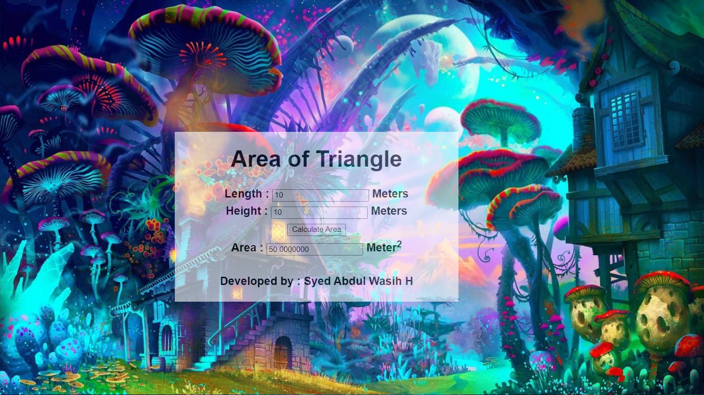

# Design a Website for Server Side Processing

## AIM:
To design a website to perform mathematical calculations in server side.

## DESIGN STEPS:

### Step 1:
Design your website for calculation using wireframe work.
### Step 2:
Then to execute the wireframe work design use HTML,CSS.
### Step 3:
Use views.py to execute the coding in server side.
### Step 4:
Mention the path of the website in urls.py.
### Step 5:
Publish the website in the given URL.

## PROGRAM :

## Area.html:
~~~
<!DOCTYPE html>
<html>
<head>
    <meta charset='utf-8'>
    <meta http-equiv='X-UA-Compatible' content='IE=edge'>
    <title>Math Calculation</title>
    <meta name='viewport' content='width=device-width, initial-scale=1'>
    
    
</head>
<body>
    

    

    <h1>Area of Triangle</h1>
    <form method="POST">
        
        

        Length : <input type="text" name="Base" value=""></input> Meters 
        

        

        Height : <input type="text" name="Height" value=""></input> Meters 
        

        
        

        <input type="submit"  value="Calculate Area"></input> 
        

        

        Area : <input type="text" name="Area" value=""></input> Meter2 
        

         
        

          <B>
Developed by : Syed Abdul Wasih H 
</B> 
          

    
    </form>
    

    

</body>
</html>
~~~
## Views.py:
~~~
from django.shortcuts import render
def volumecalculation(request):
    context={}
    context['b'] = "0"
    context['h'] = "0"
    context['area'] = "0"
    
    if request.method == 'POST':
        b = request.POST.get('base','0')
        h = request.POST.get('height','0')
        
        area =(int(b)*int(h))/2
        context['b'] = b
        context['h'] = h
        context['area'] = area
  
    return render(request,'area.html',context)
~~~
## Urls.py:
~~~
"""calculation URL Configuration

The `urlpatterns` list routes URLs to views. For more information please see:
    https://docs.djangoproject.com/en/3.1/topics/http/urls/
Examples:
Function views
    1. Add an import:  from my_app import views
    2. Add a URL to urlpatterns:  path('', views.home, name='home')
Class-based views
    1. Add an import:  from other_app.views import Home
    2. Add a URL to urlpatterns:  path('', Home.as_view(), name='home')
Including another URLconf
    1. Import the include() function: from django.urls import include, path
    2. Add a URL to urlpatterns:  path('blog/', include('blog.urls'))
"""

from django.contrib import admin
from django.urls import path
from mathapp import views

urlpatterns = [
    path('admin/', admin.site.urls),
    path('areaofrect/',views.areacalc,name="areaofrect"),
    path('',views.areacalc,name="areaofrect")]

~~~

## OUTPUT:

## Result:
A website to perform mathematical calculations in server side is created.
